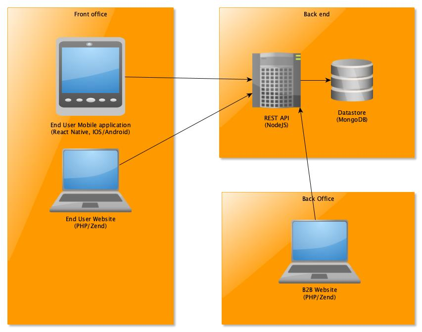

# Hackathon Greentech 2019

## Architecture

## Mobile app

Forked from [steniowagner/bon-appetit-app: A React-Native App that shows options of Restaurants, Gastronomic Events and Dishes in the City of Fortaleza (Brazil).](https://github.com/steniowagner/bon-appetit-app).

## REST API

Forked from [steniowagner/bon-appetit-server: RESTful API built with NodeJS + Express + MongoDB that serves the Bon-Appetit App.](https://github.com/steniowagner/bon-appetit-server)

## References

- Diagram editor - [yEd](https://www.yworks.com/products/yed)

